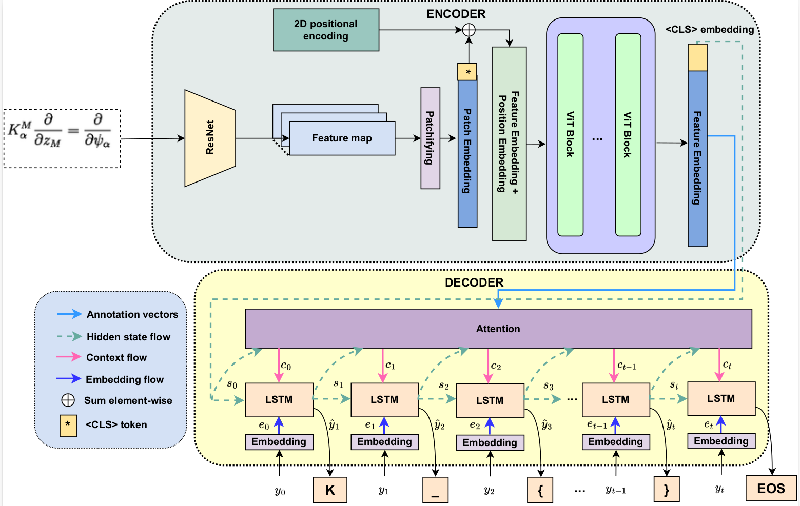
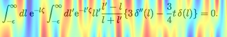
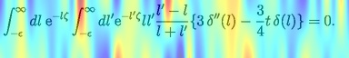
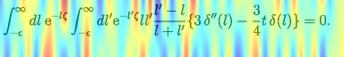
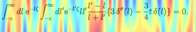

# Current architecture

# Idea
- ### Apply GNN for encoder to enhance feature extraction and seq modeling:
    + [X] Approach 1: Replace ViT block with graph-related block (ViGNN[^1])
    + [ ] Approach 2: Construct a GCN to embed image patches before ViT modeling (Graph-Transformer[^2])
    + [ ] Approach 3: Similar to Graph-Transformer idea but build a LOS graph based on LPGA paper [[paper]](https://ieeexplore.ieee.org/document/8978044)
    + [ ] Approach 4: Create a parallel GNN block (maybe a GGCN[^3] layer) with ViT block to enhance extraction. 

- ### Apply GNN in decoder to augment the decoding process with syntactic information:

# Experiments
- ## Approach 1: VIGNN [Link](https://arxiv.org/abs/2206.00272)
    1. **Experment 1 (06/02/2023)**:
        + **Dataset**:
            <ul>
            <li> Im2LaTeX100K (DENG et al PROCESSED)
            <li> Max dimension: 800, 800
            <li> Min dimension: 32, 32
            <li> Augmentation: Yes
            <li> RGB: Grayscale
            <li> Max seq length: 150
            <li> Data split: Train: 83883, Validation: 9319
            </ul>
        + **Modification detail**
            ```python:
                num_knn = [int(x.item()) for x in torch.linspace(numpoints - self.n_blocks, numpoints, self.n_blocks)]
            ```
            ```python:
            for i in range(self.n_blocks):
            dilation = int(i//4 + 1)
            if self.use_dilation:
                dilation = int(i//4 + 1) if max(num_knn)*dilation <= numpoints else 1
            else:
                dilation = 1
            ```
        + **Model configuration:**
            1. Feat extractor:
                <ul>
                <li> Name: ResNet
                <li> Out channel: 512
                </ul>
            2. Seq modeling:
                <ul>
                <li> Name: ViGNN
                <li> Patch size: 2
                <li> Hidden size: 256
                <li> #Blocks: 6
                <li> Dilations: Yes
                <li> Graph conv: 'MR' (Max-Relative Graph Convolution)
                </ul>
            3. Predictor:
                <ul>
                <li> Attention
                <li> input size: 256
                <li> hidden size: 256
                <li> Attention cell: Coverage
                <li> Kernel dim: 128
                <li> Kernel size: 2
                </ul>
        + **Train configuration**
            <ul>
            <li> Iteration: 3e+5
            <li> Batch size: 32
            <li> LR: 5e-3
            <li> Scheduler: Cosin with warmup
            <li> Grad clip: Norm (Max = 5)
            <li> Criterion: CE
            <li> Optimizer: AdamW
            </ul>

        + **Result:**
        
        | Iteration | Best accuracy | Best edit distance | Best BLEU |
        | :--------:| :-----------: | :--------------:   |  :------: |
        |  20000    |     0.00      |   0.26             |  0.123    |
        |  300000   |     3.453     |   0.46             |  0.351    |

        + **Qualitative Analysis**
            - Logging information: [[Debug Logging]](vignn/experiment_0602/forward_logger.txt)
            - Activation map of first block:
               +  
            - Activation map of last block:
                + 

        + **Conclusion**
            + Number of KNN too large -> reduce
            + Dilation is alway equal to 1
            + Encoder cannot learn with current config

    2. **Experment 2 (21/02/2023)**:
        + **Dataset**:
            <ul>
            <li> Im2LaTeX100K (DENG et al PROCESSED)
            <li> Max dimension: 800, 800
            <li> Min dimension: 32, 32
            <li> Augmentation: Yes
            <li> RGB: Grayscale
            <li> Max seq length: 150
            <li> Data split: Train: 83883, Validation: 9319
            </ul>
        + **Modification detail**
            + Change *num_knn* 
            ```python:
                num_knn = [int(x.item()) for x in torch.linspace((numpoints - self.n_blocks)//self.n_blocks, (numpoints + self.n_blocks)//self.n_blocks, self.n_blocks)]
                min_dilation = numpoints // max(num_knn)
            ```
            + Change *dilation*
            ```python:
            for i in range(self.n_blocks):
            dilation = int(i//4 + 1)
            if self.use_dilation:
                dilation = int(i//4 + 1) if num_knn[i]*dilation <= numpoints else min_dilation
            else:
                dilation = 1
            ```
        + **Model configuration:**
            1. Feat extractor:
                <ul>
                <li> Name: ResNet
                <li> Out channel: 512
                </ul>
            2. Seq modeling:
                <ul>
                <li> Name: ViGNN
                <li> Patch size: 2
                <li> Hidden size: 256
                <li> #Blocks: 6
                <li> Dilations: Yes
                <li> Graph conv: 'MR' (Max-Relative Graph Convolution)
                </ul>
            3. Predictor:
                <ul>
                <li> Attention
                <li> input size: 256
                <li> hidden size: 256
                <li> Attention cell: Coverage
                <li> Kernel dim: 128
                <li> Kernel size: 2
                </ul>
        + **Train configuration**
            <ul>
            <li> Iteration: 3e+5
            <li> Batch size: 32
            <li> LR: 5e-3
            <li> Scheduler: Cosin with warmup
            <li> Grad clip: Norm (Max = 5)
            <li> Criterion: CE
            <li> Optimizer: AdamW
            </ul>

        + **Result:**

        | Iteration | Best accuracy | Best edit distance | Best BLEU |
        | :--------:| :-----------: | :--------------:   |  :------: |
        |  20000    |     0.00      |   0.28             |  0.147    |

        + **Qualitative Analysis**
            - Logging information: [[Debug Logging]](vignn/experiment_2202/forward_logger.txt)
            - Activation map of first block:
               +  
            - Activation map of last block:
                + 

        + **Conclusion**
            + Improve a little bit compared to previous exp at iter 20000
            + Still learn very slow

    3. **Experment 3 (23/02/2023)**:
        + **Dataset**:
            <ul>
            <li> Im2LaTeX100K (DENG et al PROCESSED)
            <li> Max dimension: 800, 800
            <li> Min dimension: 32, 32
            <li> Augmentation: Yes
            <li> RGB: Grayscale
            <li> Max seq length: 150
            <li> Data split: Train: 83883, Validation: 9319
            </ul>
        + **Modification detail**
            + Change *dilation*
            ```python:
            for i in range(self.n_blocks):
            dilation = int(i//2 + 1)
            if self.use_dilation:
                dilation = int(i//2 + 1) if num_knn[i]*dilation <= numpoints else min_dilation
            else:
                dilation = 1
            ```
        + **Model configuration:**
            1. Feat extractor:
                <ul>
                <li> Name: ResNet
                <li> Out channel: 512
                </ul>
            2. Seq modeling:
                <ul>
                <li> Name: ViGNN
                <li> Patch size: 2
                <li> Hidden size: 256
                <li> #Blocks: 6
                <li> Dilations: Yes
                <li> Graph conv: 'MR' (Max-Relative Graph Convolution)
                </ul>
            3. Predictor:
                <ul>
                <li> Attention
                <li> input size: 256
                <li> hidden size: 256
                <li> Attention cell: Coverage
                <li> Kernel dim: 128
                <li> Kernel size: 2
                </ul>
        + **Train configuration**
            <ul>
            <li> Iteration: 3e+5
            <li> Batch size: 32
            <li> LR: 5e-3
            <li> Scheduler: Cosin with warmup
            <li> Grad clip: Norm (Max = 5)
            <li> Criterion: CE
            <li> Optimizer: AdamW
            </ul>

        + **Result:**

        | Iteration | Best accuracy | Best edit distance | Best BLEU |
        | :--------:| :-----------: | :--------------:   |  :------: |
        |  20000    |     0.00      |   0.28             |  0.147    |

        + **Qualitative Analysis**
            - Logging information: [[Debug Logging]](vignn/experiment_2202/forward_logger.txt)
            - Activation map of first block:
               +  
            - Activation map of last block:
                + 

        + **Conclusion**
            + Improve a little bit compared to previous exp at iter 20000
            + Still learn very slow

- ## Approach 4: Parallel GNN block [Link](https://arxiv.org/abs/1511.05493)

[^1]: https://github.com/huawei-noah/Efficient-AI-Backbones/blob/master/vig_pytorch/readme.md
[^2]: https://github.com/vkola-lab/tmi2022
[^3]: https://github.com/chingyaoc/ggnn.pytorch